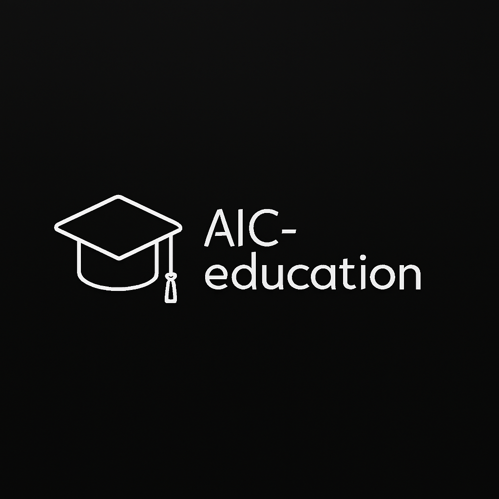

# AIC-Education
AI For Education

<p align="center">
  
</p>

> Rebuilding Human Learning for the Adaptive Era

**AIC-Education is the educational branch of the Adaptive Intelligence Circle (AIC). It focuses on redesigning learning systems for the age of Adaptive Intelligence.** 

Instead of following the traditional model of “memorize – test – certify”,  AIC-Education aims to build:

🧠 Adaptive Learning Systems

🔁 Reflective and Iterative Thinking

🛡 Ethical and Responsible AI Literacy

🏗 Systems Thinking and Civilization-Scale Awareness

🤝 Human–AI Collaboration Models

--- 

### 🎯 Mission

#### 1. Develop adaptive learning frameworks tailored to individual cognitive profiles.

#### 2. Design educational modules for:

- AI Ethics

- Adaptive Systems Engineering

- Governance and Responsibility

- Simulation-Based Learning

#### 3. Integrate:

- Human Meaning Network (HMN)

- AIC Governance Framework

- AIC Agents & Simulation Modules

#### 4. Establish a globally scalable educational model grounded in ethical depth and long-term responsibility.

---

### 🏗 Proposed Structure 

``` pgsql 

AIC-Education/
│
├── curriculum/
├── simulation/
├── ethics/
├── research/
├── tools/
├── docs/
│
├── README.md
├── Code_of_Conduct.md
├── Security.md
└── Contributing.md

```
--- 

### 🧩 Core Principles

- Education is not content delivery.

- Education is cognitive architecture design.

- AI must amplify moral clarity, not replace human responsibility.

- Learning must include structured failure analysis and ethical reflection.

- Knowledge without ethical grounding is structurally unstable.

--- 

### 🌍 Long Term Vision

AIC-Education is not merely an open-source repository. It is an experimental framework for restructuring how civilization approaches:

- Technological responsibility

- Knowledge ecosystems

- Human–AI coexistence

- Sustainable civilizational development

--- 

### LICENSE 

GENERAL PUBLIC LICENSE - GNU GPL-3.0


